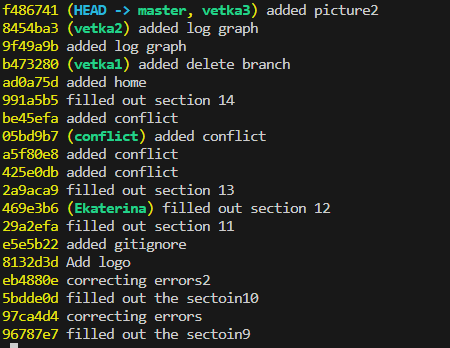
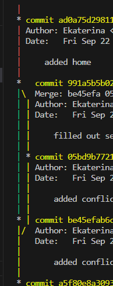

# Инструкция по Git

## 1. Проверка наличия установленного Git

В терминале выполняем команду **git --version**.

Если Git установлен , то появится сообщение с информацией о версии файлов.
*Иначе будет сообщение об ошибке.*

## 2. Установка Git

Загружаем последнию версию Git c сайта

https://git-scm.com/download/win

## 3.  Настройка Git

При первом использование Git нужно представиться, для этого нужно ввести две команды:
*  **git config --global user.name "Ваше_имя"**

*  **git config --global user.email "адрес_почты@email.com"**

Для того чтобы проверить прошла ли регистрация надо ввести команду:

**git config --list**

## 4. Инициализация репозитория

Для того чтоб инициализировать репозиторий надо ввести команду **git init**

В исходной папке появится папка .git

## 5. Проверка состояния репозитория

Для того, чтобы проверить текущие состояние репозитория и посмотреть, какие были внесены изминения, надо ввести команду **git status**

## 6. Сохранение изменений в редакторе.

Чтобы сохранить внесенные изменения в редакторе из рабочего каталога в раздел проиндексированных файлов, надо ввести команду **git add**

## 7. Сохранение изменений в репозитории.

Чтобы сохранить индексированные изменения в репозитории, надо ввести команду **git commit  -m"Комментарий к коммиту"**

## 8. История коммитов

Для того, чтобы посмотреть историю всех коммитов, надо ввести команду **git log**

Чтобы посмотреть список в укороченом формате, надо ввести команду **git log --oneline**
Вот так это выглядит:

## 9. Просмотр индексированных и неиндексированных изменений

Если вы хотите посмотреть какие конкретно изменения были внесены в рабочей дериктории,надо ввести команду **git diff**

*Если использовать команду git diff перед каждым коммитом, то можно избежать ошибок в добавляемые изменения.*

## 10. Переключение между коммитами

Для перемещения между коммитами и просмотра состояния репозитория в определенной точке, надо использовать команду **git checkout индекс коммита**

Для того ,чтобы вернуться в текущее состояние ,надо ввести команду **git checkout master**

## 11. Добавление картинок и игнорирование файлов

Для того, чтобы разместить картинку в нвшем файле, надо добавитьее в папку и после этогов нужном месте пишем следуйщее:

Для того,чтобыудалить файлы изображениями надо создать файл **.gitignore**

## 12.Ветвление

Для создания новой ветки ,надо ввести в терминале команду **git branch name_branch**

Ветвление необходимо для работы с файлами в отдельной ветке,сохраняя при этом исходное состояние файла до их слияния.

Чтобы отобразить созданные ветки,используется команда **git branch**
Таким образом это будет выглядеть:

Чтобы перейти на другую ветку, используем команду **git checkout name_branch**

Чтобы понять взоимодействие между коммитами и ветками, надо ввести команду **git log --graph**

## 13. Слияние веток

Для слияния веток и внесения изменений в наш основной файл используется команда **git merge name_branch**

Слияние делается в ту ветку в которой мы находимся сейчас.

## 14. Конфликты

Конфликты возникают при слиянии двух веток в одну, при этом должна быть изменена одна и та же строка файла.
Конфликт выглядит вот так:

## 15. Удаление ветки

Чтобы удалить указанную  ветку, даже если в ней есть неслитые изменения, надо использовать команду **git branch -d name_branch**

 # Работа с удаленным репозиторием на GitHub

## 1. Регистрация на GitHub
 Для того, чтобы зарегистрироваться на GitHub, надо перейти по ссылке github.com
 